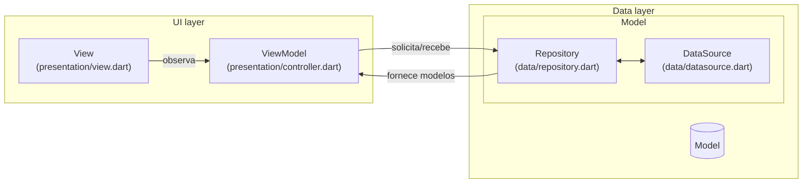
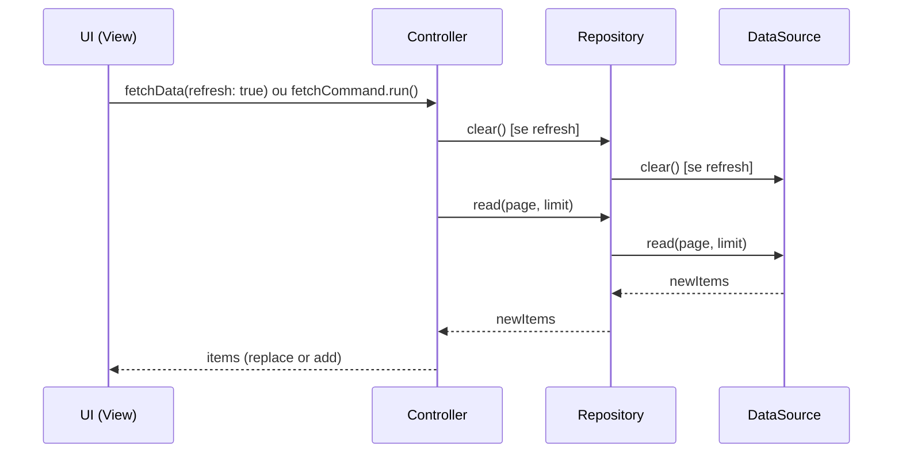

# Lista Infinita
Demonstração de lista infinita consumindo api fake.

## Propósito
`lista_infinita` é um projeto-laboratório em Flutter que demonstra a implementação de uma lista infinita (infinite scroll) com paginação e pull-to-refresh. Os dados são gerados localmente para simular um backend paginado e permitir foco nos problemas de UI, lógica de paginação, concorrência e tratamento de estados (loading/erro/sucesso).

Objetivos deste repositório:
- Servir como exemplo didático para separação de responsabilidades entre View / Controller / Repository / DataSource.
- Demonstrar os padrões Command e Result para controlar operações assíncronas e seus estados.
- Apresentar práticas simples para evitar duplicação de itens e proteger contra chamadas concorrentes.

## Visão geral do funcionamento
- A UI (View) é responsável apenas pela apresentação e por delegar eventos de usuário (como scroll e pull-to-refresh).
- O Controller (ViewModel) gerencia o estado da UI (a lista de itens), a lógica de paginação, o refresh e expõe um `Command` que a View observa para reagir a mudanças de estado (carregando, erro, sucesso).
- O Repository orquestra a busca de dados, atuando como um intermediário para o DataSource.
- O DataSource é a fonte da verdade dos dados, simulando uma API remota ou um banco de dados local.

## Padrões aplicados: Command e Result

### Command
- Encapsula uma operação assíncrona (neste caso, o fetch de páginas) junto com seu estado (idle, running, success, failure).
- A View observa o `Command` para renderizar indicadores de carregamento e mensagens de erro de forma reativa.
- No projeto: o `Controller` expõe um `fetchCommand` (veja `lib/presentation/controller.dart`).

### Result
- Representa o resultado de uma operação que pode falhar (sucesso ou erro) como um valor único, forçando o tratamento explícito de erros.
- O `Repository` utiliza este padrão em seu método `read`, retornando `Future<Result<List<Produto>, Exception>>`. Isso garante que o `Controller` trate tanto o caso de sucesso (recebendo a lista de produtos) quanto o de falha.

## Controle de concorrência
O `Command` implementa um bloqueio lógico (single-flight) que impede que múltiplas chamadas de `fetch` sejam executadas ao mesmo tempo, evitando requisições duplicadas quando o usuário rola a lista rapidamente ou aciona o refresh durante uma carga.

## Arquitetura aplicada (resumo)

- **UI / Widgets**:
	- `lib/presentation/view.dart` — widget que contém `RefreshIndicator` e `ListView.builder`, observando o `fetchCommand` do Controller.

- **Controller / State (ViewModel)**:
	- `lib/presentation/controller.dart` — gerencia o estado da UI (a lista `items`), coordena a paginação e o refresh, e expõe o `fetchCommand`.

- **Repositório**:
	- `lib/data/repository.dart` — orquestra a chamada ao `DataSource` e encapsula o resultado em um objeto `Result` (Success/Failure). É um componente stateless.

- **Fonte de Dados**:
	- `lib/data/datasource.dart` — implementação da origem dos dados. Neste projeto, ele gera dados falsos (`fake`) e simula a persistência e a latência de uma API.

- **Model**:
	- `lib/domain/models/produto.dart` — definição do modelo `Produto`.

## Diagrama de arquitetura (imagem)


## Diagrama de arquitetura (Mermaid)


## Diagrama de sequência (fluxo de fetch)


## Contratos públicos (resumo)

- **`Repository.read({int page, int limit}) -> Future<Result<List<T>, Exception>>`**
	- Solicita ao `DataSource` os itens para uma página específica.
	- Retorna um `Result` contendo os `newItems` em caso de sucesso ou uma `Exception` em caso de falha.

- **`DataSource.read({int page, int limit}) -> Future<List<T>>`**
	- Fornece os itens para uma página específica (neste caso, gerando-os).
	- Simula a latência de rede com um `Future.delayed`.

- **`Controller.fetchCommand.run(bool isRefresh)`**
	- Executa a lógica de busca de dados.
	- Se `isRefresh == true`: limpa o `DataSource` e a lista local de itens, recarregando a primeira página.
	- Se `isRefresh == false`: carrega a próxima página e concatena os novos itens à lista existente.

## Como rodar localmente
Pré-requisitos:
- Flutter SDK instalado.

```powershell
flutter pub get
flutter run
```

## Testes
O repositório contém testes unitários para o `Repository` e o `Controller`.

- Executar todos os testes:
```powershell
flutter test
```

- Executar um único arquivo de teste:
```powershell
flutter test test/controller_test.dart
```
