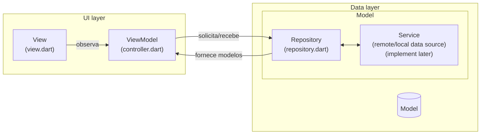
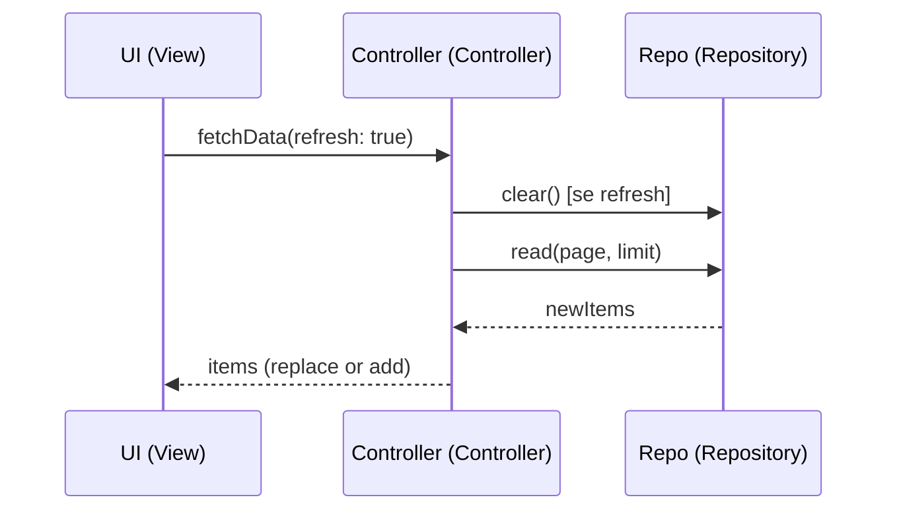

# Lista Infinita
Demonstração de lista infinita consumindo api fake.

Propósito
---------
`lista_infinita` é um exemplo pequeno e direto em Flutter que demonstra uma lista infinita com paginação e pull-to-refresh. O projeto gera dados localmente (fábrica de modelos) para simular uma API paginada e focar nas preocupações de UI e lógica de paginação (evitar duplicações, controlar concorrência).

Este repositório serve como base de código para desenvolvedores que querem:
- estudar padrões de separação de responsabilidades (UI / Controller / Repository),
- entender problemas comuns em paginação (duplicação de itens, concorrência),
- ver estratégias simples de teste unitário para lógica de domínio.

## Público-alvo

O projeto é indicado para desenvolvedores Flutter iniciantes a intermediários que desejam um exemplo prático de:
- Implementação de lista infinita com paginação e refresh;
- Separação entre camada de apresentação (widgets), controladora (controller) e repositório (fonte dos dados);
- Boas práticas simples: contratos claros entre repositório e controller, proteção contra chamadas concorrentes e testes automatizados.

## Arquitetura aplicada

O projeto adota uma arquitetura leve, baseada em camadas e responsabilidades claras (inspirada em MVVM/Controller-lite):

- UI / Widgets:
	- `lib/main.dart` — ponto de entrada do MaterialApp.
	- `lib/presentation/viewe.dart` — widget de tela que contém `RefreshIndicator` e `ListView.builder`, observando o `Controller` via `AnimatedBuilder`.

- Controller / State:
	- `lib/presentation/controller.dart` — gerencia estado da lista, paginação, controle de loading, `ScrollController` e lógica de fetch.
	- Expõe `items`, `isLoading` (ValueNotifier), `isRefreshing` e `scrollController`.

- Repositório / Fonte de Dados:
	- `lib/data/repository.dart` — simula fonte paginada; possui método `read({page, limit})` que gera itens via fábrica e mantém `_items` localmente.
	- Fornece `clear()` para resetar o armazenamento.

- Model:
	- `lib/domain/models/produto.dart` — definição do `Produto` e `factory(int index)` que produz itens de exemplo.

Fluxo de dados (resumido):

1. `View` chama `HomeController.fetchData(refresh: true)` quando o usuário puxa para atualizar (pull-to-refresh).
2. `Controller` coordena o reset (quando necessário), inicia um load e chama `HomeRepository.read(page, limit)` para obter os itens da próxima página.
3. `Repository.read` gera `newItems` para a página solicitada, adiciona-os ao seu armazenamento interno `_items` e retorna apenas `newItems`.
4. `Controller` decide se substitui a lista (`items = newItems`) no caso de refresh, ou concatena (`items.addAll(newItems)`) no caso de paginação.
5. A UI observa o controller e rebuilda a lista.

Decisões de design importantes:

- `read` retorna apenas os novos itens (não a lista completa): isso deixa o contrato explícito e evita duplicações acidentais quando consumidores fizerem `addAll` na lista local.
- Single-flight (`_ongoingFetch` no controller): evita chamadas concorrentes que poderiam gerar duplicação quando duas requisições são feitas simultaneamente.
- Uso de `ValueKey(produto.id)` nos `ListTile`: ajuda o Flutter a reconciliar widgets corretamente, dando estabilidade visual na UI.


Decisões rápidas
-----------------
- `read` retorna somente a página solicitada (evita confusão quando quem consome faz `addAll`).
- Controller usa um bloqueio single-flight para evitar fetches concorrentes que causariam duplicação.
- `ListTile` usa `ValueKey(produto.id)` para estabilidade visual.


## Diagrama de arquitetura time google 


Legenda (mapeamento dos blocos para arquivos do projeto):

- View (UI): `lib/presentation/view.dart` — contém o `RefreshIndicator` e a `ListView`.
- ViewModel: `lib/presentation/controller.dart` — gerencia estado, paginação e lógica de fetch.
- Repository: `lib/presentation/repository.dart` — provê `read` e `clear` e mantém armazenamento local `_items`.
- Service (Data Source): não implementado separadamente neste laboratório; aqui você poderia adicionar `lib/data/datasource.dart`.


## Diagrama de arquitetura (Mermaid)

Abaixo há uma versão Mermaid adaptada do diagrama do time do Google. Ela mostra as camadas UI e Data, com o ViewModel ligando a View ao Repository/Service.



## Diagrama de sequência (fluxo de fetch)



## Contratos públicos (resumo)

- `HomeRepository.read({int page = 1, int limit = 20}) -> Future<List<T>>`
	- Gera e adiciona os itens dessa página ao armazenamento interno `_items`.
	- Retorna apenas os `newItems` gerados nesta chamada (contrato claro para os consumidores).
	- Não lança (neste laboratório) — em um sistema real deve expor erros via exceção ou objeto de resultado.

- `Repository.clear()`
	- Limpa o armazenamento interno `_items`.

- `Controller.fetchData({bool refresh = false}) -> Future<void>`
	- Single-flight: múltiplas chamadas concorrentes aguardam a mesma operação em andamento.
	- Se `refresh == true`: limpa repositório e lista local, reseta `_currentPage` e carrega a primeira página (substitui `items`).
	- Se `refresh == false`: carrega a próxima página e concatena os `newItems` a `items`.

## Como rodar localmente

Pré-requisitos: Flutter SDK (compatível com o SDK no `pubspec.yaml`).

No PowerShell (Windows), dentro da pasta do projeto:

```powershell
cd "Caminho do projeto"
flutter pub get
flutter run
```

## Testes

O projeto inclui testes unitários em `test/` que validam:
- `Repository.read` (retorno dos novos itens e atualização do armazenamento interno);
- `Controller.fetchData` (comportamento de paginação, refresh e chamadas concorrentes).

Os testes foram executados localmente e passam.

